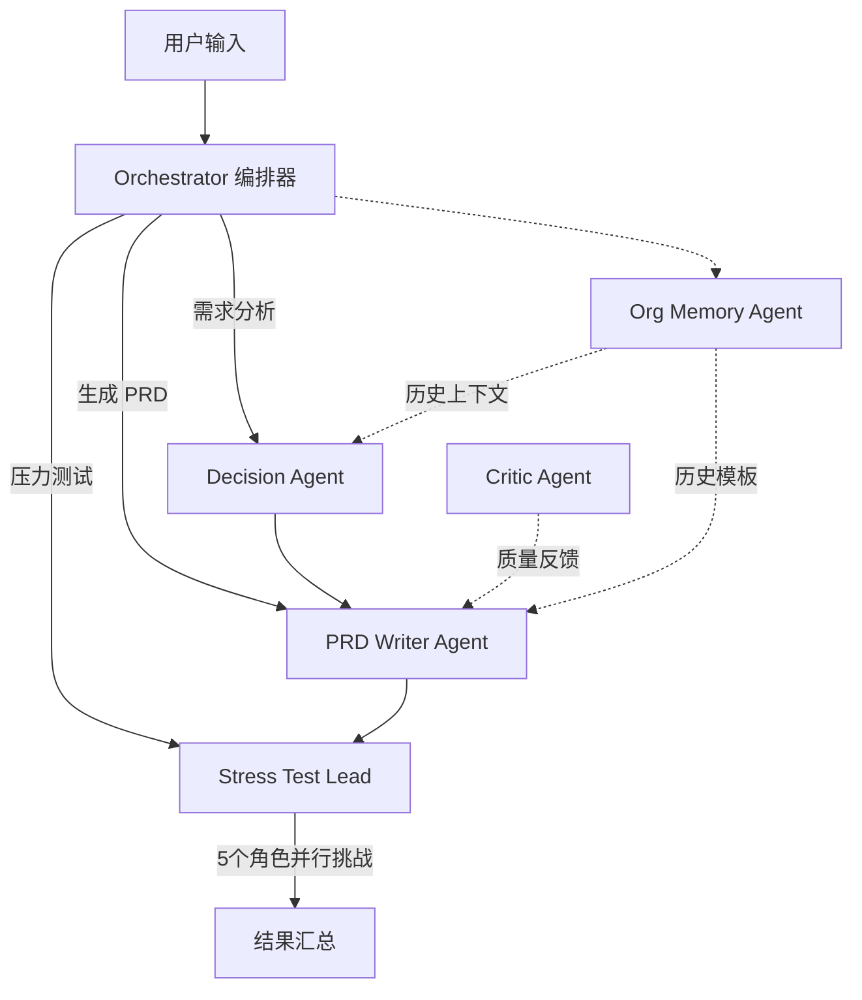

# PM Copilot

> AI 产品经理的决策与质量保障助手 — 用 Multi-Agent 协作帮 PM 做出更好的产品决策。

## ✨ 核心特性

- **三段式工作流**：需求决策 → PRD 生成 → 压力测试，覆盖产品经理核心工作链路
- **Multi-Agent 协作**：6 个专业 Agent 分工明确，由 LangGraph 编排器统一调度
- **组织记忆 (Org Memory)**：基于 ChromaDB 的向量检索，积累团队历史决策与 PRD 经验
- **红队压力测试**：从老板、开发、用户、竞品、合规 5 个视角挑战你的方案
- **实时可视化**：前端实时展示 Agent 执行状态与协作时间线

## 🏗️ 架构



## 🛠️ 技术栈

| 层级 | 技术 |
|------|------|
| Agent 编排 | LangGraph + LangChain |
| API 层 | FastAPI + SSE Streaming |
| 向量库 | ChromaDB |
| LLM | OpenAI GPT-4o / Claude Sonnet（按 Agent 分级路由） |
| Embedding | OpenAI text-embedding-3-small |
| 前端 | Next.js 14 + TypeScript + TailwindCSS + shadcn/ui |
| 包管理 | 后端 uv/pip，前端 pnpm |

## 🧠 模型选型策略

不同 Agent 对模型能力的需求差异很大，采用**分级路由**策略：

| Agent | 模型选择 | 选型理由 |
|-------|---------|---------|
| Orchestrator（意图路由） | GPT-4o-mini | 仅做分类，快+便宜 |
| Decision Agent（5W1H 分析） | Claude Sonnet | 需要深度推理和结构化输出 |
| PRD Writer（文档生成） | Claude Sonnet | 长文写作质量最佳 |
| Stress Test Lead（5 角色并行） | GPT-4o-mini × 5 | 并行 5 次调用，成本降 10 倍 |
| Critic Agent（质量审查） | Claude Sonnet | 精细推理（v0.2） |
| Org Memory（RAG 整合） | GPT-4o-mini | 仅做上下文摘要，轻量即可 |

**核心原则：** 强推理用大模型（Claude Sonnet），轻任务用小模型（GPT-4o-mini），单次完整流程成本约 ¥0.3。

**Fallback 机制：** 主力模型超时/失败时自动降级到备用模型（GPT-4o），保障可用性。

## 🚀 快速启动

### 后端

```bash
cd backend
cp .env.example .env
# 编辑 .env 填入 OPENAI_API_KEY

# 使用 uv（推荐）
uv venv && uv pip install -e .

# 或使用 pip
pip install -e .

# （可选）灌入演示知识库 + 生成 Org Profile
python seed_memory.py

# 启动服务
uvicorn app.main:app --reload --port 8000 --host 127.0.0.1
```

### 前端

```bash
cd frontend
npm install
npm run dev
# 访问 http://localhost:3000
```

右侧「组织记忆」面板可上传 Markdown、查看 Org Profile 与本次检索引用。

## 📁 项目结构

```
pm-copilot/
├── backend/          # Python 后端
│   ├── app/
│   │   ├── agents/   # 6 个专业 Agent
│   │   ├── graph/    # LangGraph 工作流编排
│   │   ├── memory/   # ChromaDB 向量存储
│   │   ├── models/   # Pydantic 数据模型
│   │   └── prompts/  # Prompt 模板
│   └── tests/
├── frontend/         # Next.js 前端
│   ├── app/          # 页面 & API routes
│   ├── components/   # UI 组件
│   └── lib/          # 工具函数 & 类型
└── docs/             # 架构文档
```

## 📄 License

MIT
