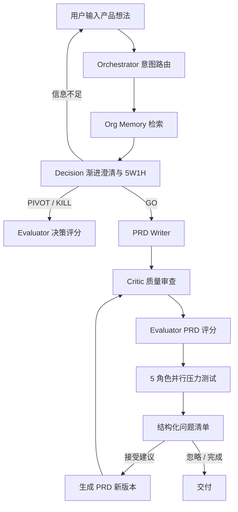

# PM Copilot

> AI 产品经理的决策与质量保障助手：用可观察的 Multi-Agent 工作流，把产品想法推进为经过评审、可持续修订的 PRD。

## ✨ 核心能力

- **决策优先**：通过渐进式澄清和 5W1H 分析给出 GO / PIVOT / KILL，避免未经判断直接生成文档。
- **明确的流程门禁**：GO 可以继续生成 PRD；PIVOT / KILL 停在评估环节，防止错误方案被自动推进。
- **PRD 版本化修订**：已有 PRD 时进入修订模式，保留未受影响章节，并生成 v2、v3 等新版本。
- **质量双检**：Critic 检查内容质量，Evaluator 从完整性、一致性、需求契合度、清晰度和可落地性五个维度评分。
- **五角色红队评审**：老板/投资人、技术负责人、真实用户、竞品分析师、合规专家并行挑战方案。
- **问题处理闭环**：压力测试保留全部问题并去重，可逐项接受或忽略；接受的问题可一键应用到下一版 PRD。
- **失败隔离**：某个评审角色失败时，其余角色的结果仍会正常返回，并明确显示未完成角色。
- **组织记忆**：基于 ChromaDB 检索历史 PRD、术语和团队经验，展示引用来源和 Org Profile。
- **会话与项目管理**：浏览器本地保存项目、对话、流程状态和结构化产物。
- **实时可观察**：SSE 推送 Agent 状态、耗时、重试、Token 使用和评估结果，且每个节点只发布自己的产物。

## 🔄 业务流程



典型使用方式：

1. 描述真实产品需求，回答最多几轮关键澄清问题。
2. 查看 GO / PIVOT / KILL 决策和自动评分。
3. 对 GO 方案继续生成 PRD，或直接选择“完整流程”。
4. 在压力测试清单中接受、忽略问题。
5. 点击“应用已接受建议并生成新版本”，继续评审直到可交付。

也可以直接选择“压力测试”并粘贴一份完整 PRD；没有 PRD 时系统会明确提示，不会生成空评审。

## 🏗️ Agent 分工

| 节点 | 职责 | 默认模型路由 |
|------|------|-------------|
| Orchestrator | 识别意图并选择流程入口 | `openai:gpt-4o-mini` |
| Org Memory | 检索组织经验、术语和历史模板 | `openai:gpt-4o-mini` |
| Decision | 渐进澄清、5W1H、GO/PIVOT/KILL | `openai:gpt-4o` |
| PRD Writer | 创建或修订完整 PRD | `openai:gpt-4o` |
| Critic | 内容质量检查与改进建议 | `openai:gpt-4o` |
| Evaluator | 决策/PRD 五维结构化评分 | 复用 Critic 路由 |
| Stress Test | 5 个角色并行红队挑战 | `openai:gpt-4o-mini` × 5 |
| Memory Writeback | 上传式记忆回流边界 | 不自动写入对话产物 |

模型均可通过 `.env` 调整。启用 `ENABLE_FALLBACK=true` 后，主模型失败会尝试 `FALLBACK_MODEL`。

## 🛠️ 技术栈

| 层级 | 技术 |
|------|------|
| Agent 编排 | LangGraph + LangChain |
| API 与实时通信 | FastAPI + Server-Sent Events |
| 数据模型 | Pydantic |
| 向量检索 | ChromaDB + OpenAI Embedding |
| LLM | OpenAI；可选 Anthropic |
| 前端 | Next.js 16 + React 18 + TypeScript + Tailwind CSS |
| 包管理 | 后端 uv/pip，前端 npm |

## 🚀 快速启动

### 1. 启动后端

```bash
cd backend
cp .env.example .env
# 编辑 .env，至少填写 OPENAI_API_KEY

# 使用 uv（推荐）
uv venv
uv pip install -e .

# 或使用 pip
pip install -e .

# 可选：灌入演示知识库并生成 Org Profile
python seed_memory.py

uvicorn app.main:app --reload --port 8000 --host 127.0.0.1
```

### 2. 启动前端

```bash
cd frontend
npm install
npm run dev
```

浏览器访问 [http://localhost:3000](http://localhost:3000)。前端默认请求 `http://127.0.0.1:8000/api`，也可以通过 `NEXT_PUBLIC_API_URL` 修改。

### 3. 常用配置

```dotenv
DEMO_MODE=false
DEMO_SKIP_STRESS=false
RATE_LIMIT_PER_IP_PER_DAY=20
ENABLE_DECISION_CLARIFY=true
```

- `DEMO_MODE`：使用更低成本的模型路由，但默认仍保留完整流程。
- `DEMO_SKIP_STRESS`：仅在明确需要节省调用时设为 `true`。
- `RATE_LIMIT_PER_IP_PER_DAY=0`：关闭本地 IP 限流。

## 🧠 组织记忆与数据边界

- 右侧“组织记忆”面板支持上传 Markdown、查看文档、引用片段与 Org Profile。
- 对话、决策、PRD 和压力测试结果不会自动写入知识库；记忆扩充由用户上传触发。
- 向量化默认使用 OpenAI `text-embedding-3-small`。处理企业敏感内容前，请确认所选模型服务的数据政策，或替换为符合要求的 Embedding 服务。

## ✅ 测试与构建

```bash
# 后端
cd backend
python -m pytest tests/test_workflow.py tests/test_evals.py -q

# 前端
cd frontend
npm exec tsc -- --noEmit
npm run build
```

当前回归基线：后端 19 项测试通过，Next.js 生产构建通过。

项目还包含 25 个中文产品需求评测样例，用于对比单 Agent 与完整 Multi-Agent 流程的决策准确度、风险覆盖、PRD 完整度和评审覆盖率。详见 [`backend/evals/README.md`](backend/evals/README.md)。

## 📁 项目结构

```text
pm-copilot/
├── backend/
│   ├── app/
│   │   ├── agents/      # Decision、PRD、Critic、Evaluator、Stress Test 等
│   │   ├── graph/       # LangGraph 编排、路由与流式输出
│   │   ├── memory/      # ChromaDB、文档切块与 Org Profile
│   │   ├── models/      # Pydantic 请求与产物模型
│   │   ├── prompts/     # 创建与修订 Prompt
│   │   └── telemetry.py # 耗时、Token、重试观测
│   ├── evals/           # 25 个案例、实验运行器与评分器
│   └── tests/
├── frontend/
│   ├── app/             # 页面与 API 路由
│   ├── components/      # Chat、Agent、Memory、History UI
│   └── lib/             # API、类型和本地会话持久化
└── README.md
```

## 📄 License

MIT
